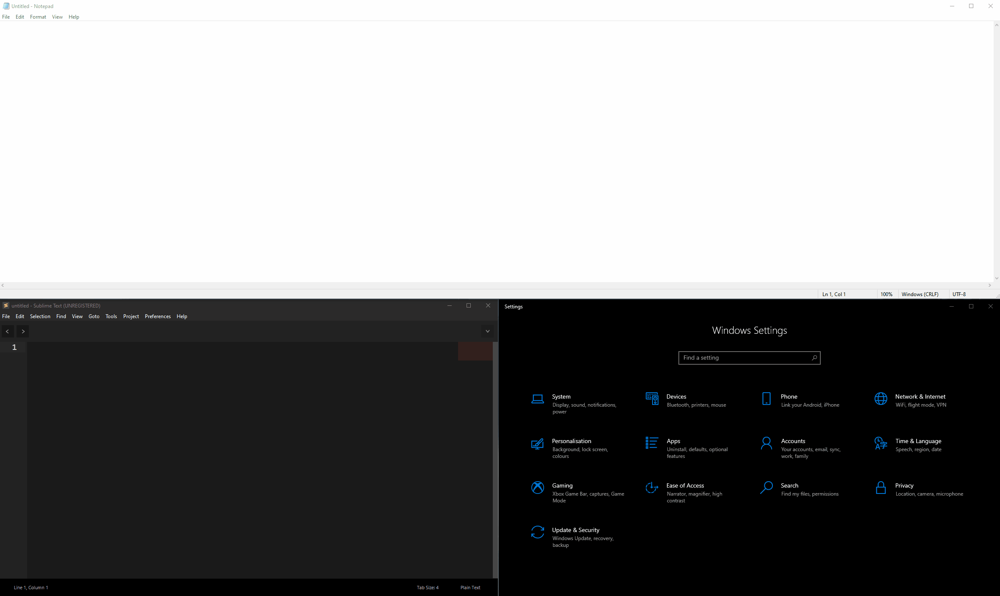

# Swing

## Info
The main purpose of this project is to help you move more fluently between windows

## Usage and Capabilities
|Action                              |Shortcut                                                  |
|------------------------------------|----------------------------------------------------------|
|Maximize window (toggle)            |<kbd>Ctrl</kbd> + <kbd>Alt</kbd> + <kbd>Enter</kbd>       |
|Minimize window                     |<kbd>Shift</kbd> + <kbd>Alt</kbd> + <kbd>Enter</kbd>      |
|Move focus to window on the right   |<kbd>Ctrl</kbd> + <kbd>Alt</kbd> + <kbd>Right Arrow</kbd> |
|Move focus to window on the left    |<kbd>Ctrl</kbd> + <kbd>Alt</kbd> + <kbd>Left Arrow</kbd>  |
|Move focus to window above          |<kbd>Ctrl</kbd> + <kbd>Alt</kbd> + <kbd>Up Arrow</kbd>    |
|Move focus to window below          |<kbd>Ctrl</kbd> + <kbd>Alt</kbd> + <kbd>Down Arrow</kbd>  |

## Demo

## Installation
Click here to download the latest release  
  
After that, unzip the file and run setup.exe